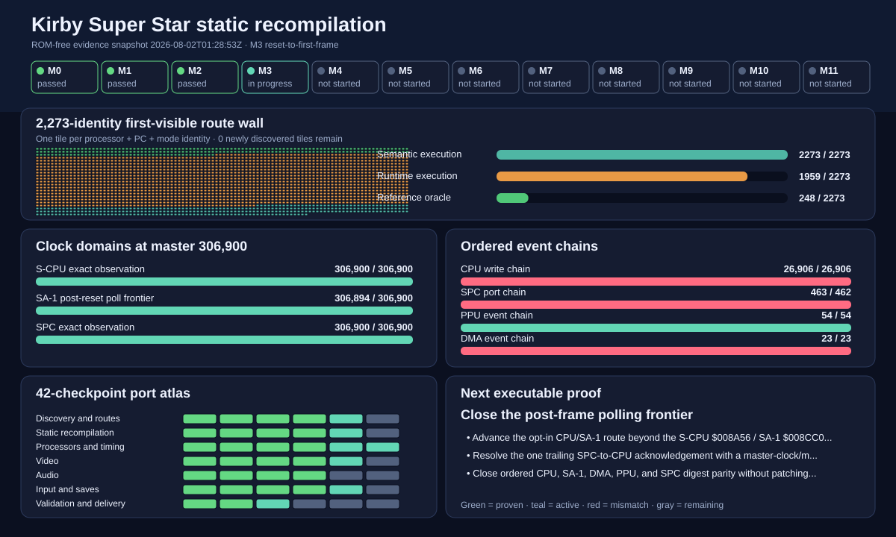

# Kirby Super Star Static Recompilation

Public, ROM-free research project for statically recompiling the SNES S-CPU and SA-1 program streams into portable C++20. The original game ROM is never committed; local tools accept a user-supplied verified ROM and keep all derived material under ignored directories.

## Accepted reference image

- Region/revision: USA, revision 0, headerless
- Size: `4,194,304` bytes
- SHA-256: `4E095FBBDEC4A16B075D7140385FF68B259870CA9E3357F076DFFF7F3D1C4A62`
- Internal map: SA-1 LoROM (`0x23`), cartridge type `0x35`

## Current state

The repository is in M3, reset-to-first-frame. The compact reset-to-visible
trace contains 2,273 dual-CPU processor/PC/mode identities and 2,440 observed
edges. The private static generator now lifts and emits all 2,273 of them: 1,032
S-CPU and 1,241 SA-1 identities. The 15 executable S-CPU WRAM identities are
decoded from an ignored private witness map; their ROM-derived bytes never enter
the public repository. The current first-frame runtime executes its original
254-identity slice. A route-only development probe can continue whole
CPU/SA-1/SPC instructions without contaminating first-frame evidence: using a
private 102-edge NMI schedule, the bounded continuation reaches its inventory
checkpoint after 1,433,720 whole blocks with all 2,273 compact-corpus
identities dispatched and no missing route identity. A prefix sweep shows that
24 of the supplied edges are sufficient; the full schedule reaches the same
checkpoint before 78 later edges are intentionally left for the next timing
proof. Its final live endpoints are S-CPU `$00002C` and SA-1 `$00A6E7`; the
outer full-schedule probe reports explicit timing debt at that finite boundary.
This closes the current reset-to-visible route corpus, not the whole game or
its behavioral parity.
The runtime now also exposes a value-free message-latch signature: the static
prefix-24 route records 95 SA-1 `$2209` writes and 9,405 S-CPU `$2300` reads
(`036824b1d673bf63`), while a separately seeded private Mesen witness at the
same 24th-NMI clock neighborhood records 76 and 8,720 (`c9d5b52ab4d84ff1`).
The signatures are deliberately treated as an open causal-parity gap until
their boundary and ordering are reconciled.
The first private ordering divergence is now localized to static event 1567:
Mesen is still polling zero when the static route emits its next SA-1 set. The
write streams stay aligned through NMI 20, then the static continuation advances
19 writes and 684 reads beyond the seeded Mesen witness, so the next work is
poll-loop/route timing reconciliation rather than changing latch masking.
All 256 opcodes have
architecture-tested execution semantics. With a runtime-only authentic IPL,
the 254 runtime identities execute through the real SPC `$CC` acknowledgement
with no patched state. Reset DMA, shared SA-1 I-RAM/control,
strict Mode 1 BG1/BG2/BG3 plus OBJ main/subscreen, windows, and color math, a
256-opcode SPC700 core with timers and DSP-register I/O, two-pad controller
register integration, and board-accurate 8 KiB save persistence exist. The
Windows executables run the verified external ROM through S-CPU setup, SA-1
initialization, the current hardware-gated checkpoint, and an exact value-free
generated S-CPU access stream. `kss-native.exe` presents the resulting 256x239
surface at integer scale and maps keyboard/XInput state onto both SNES controller
ports; execution remains paused at the explicit diagnostic frontier. The first
visible Mesen reference frame is now repeat-stable and kept private, but matching
recompiled pixels, complete SPC port replay, and gameplay remain in progress, so
this is not yet a playable port.

Open `progress/site/index.html` after running the progress generator for the
visual recompilation map. It includes all 2,273 observed reset-to-visible
block identities, a 42-checkpoint port workstream atlas, and a live
hardware-boundary map showing each clock domain and event chain against the
first `endFrame` target. Striped regions are measured work still remaining;
they are not an estimate of whole-game completion. See [PROGRESS.md](PROGRESS.md)
for the Git-safe summary.
See [platform-support.md](docs/platform-support.md) for the current Windows/
Linux support boundary and staged native-package roadmap.

On Windows, double-click `show-progress.cmd` to regenerate and open the interactive dashboard.



The `Progress dashboard` GitHub Actions workflow also rebuilds the same ROM-free
site on each progress push and publishes it through GitHub Pages. It always
uploads a downloadable Actions artifact as a fallback. Follow the live tracker
at [lite2key.github.io/kirby-super-star-recomp-private](https://lite2key.github.io/kirby-super-star-recomp-private/).

After building, run the translated boot probe with the default Downloads path
or an explicit ROM path:

```powershell
.\run-port.cmd
.\run-port.cmd "C:\path\to\Kirby Super Star (USA).sfc"
.\build\windows-ninja\kss-native.exe --rom "C:\path\to\Kirby Super Star (USA).sfc" --spc-ipl "C:\path\to\snes-ipl.bin" --save "C:\path\to\slot-a.srm"
.\build\windows-ninja\kss-recomp.exe --rom "C:\path\to\Kirby Super Star (USA).sfc" --spc-ipl "C:\path\to\snes-ipl.bin" --dump-first-frame ".private\native-first-frame.bmp"
```

`--spc-ipl` is optional and accepts only an external 64-byte SNES SPC700 IPL
image. The runtime validates and reads it directly from the supplied path; the
firmware is never copied into the repository or generated output. Omitting the
option preserves the bounded, fail-closed no-IPL diagnostic at the `$D68E`
acknowledgement wait.

The native host uses arrow keys for the D-pad; `Z/X/A/S` for `B/A/Y/X`;
right Shift and Enter for Select/Start; and `Q/W` for L/R. XInput pads 1 and 2
feed SNES ports 1 and 2. Escape or closing the window exits cleanly. Until the
translated runtime advances beyond its current frontier, shutdown intentionally
does not commit `.srm` changes.

To regenerate and compile the ignored static-recompiler output directly from
the authorized ROM, run:

```powershell
.\build-private-recomp.cmd "C:\path\to\Kirby Super Star (USA).sfc"
```

This produces 2,273 generated route block functions below `.private/generated`,
builds them in the separate `build/windows-private` tree, and runs the same
native verification suite. No ROM-derived source is added to Git.

The expected development-frontier exit code is `4`; it prevents the diagnostic
from being mistaken for a completed frame/game run.

## Local workflow

```powershell
python -m venv .venv
.\.venv\Scripts\python -m pip install -e ".[dev]"
.\.venv\Scripts\python -m pytest
cmake --preset windows-msvc
cmake --build --preset windows-msvc-debug
ctest --preset windows-msvc-debug
```

Full reference analysis is local-only:

```powershell
.\scripts\validate-rom.ps1 -RomPath "C:\path\to\Kirby Super Star (USA).sfc"
powershell -NoProfile -ExecutionPolicy Bypass -File .\scripts\ghidra-import.ps1 -RomPath "C:\path\to\Kirby Super Star (USA).sfc" -NoAnalysis
```

Pinned local analysis tools live beneath ignored `.tools/`. Ghidra projects,
raw Mesen traces, screenshots, and extracted assets stay ignored and local.

## Data boundary

Do not commit ROMs, extracted art or audio, save states, screenshots, full
instruction traces, or Ghidra project databases. This private research repo may
track bounded statically recompiled instruction functions and sanitized
identity/control-flow artifacts after the asset-boundary check passes; bulk ROM
bytes and extracted content remain prohibited.
